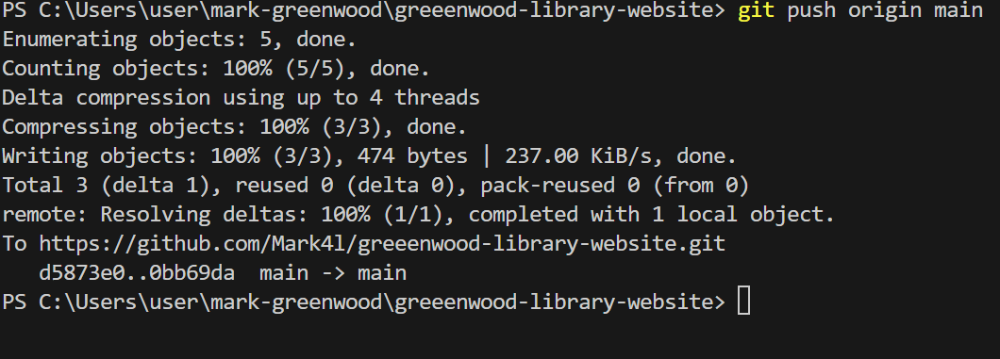
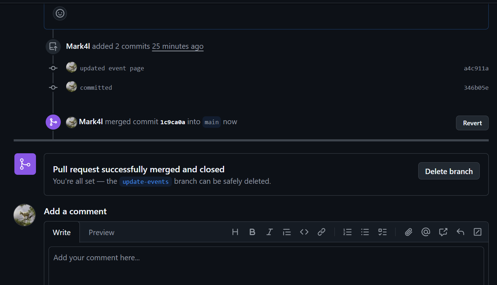

# Greenwood-Library-Website
The enhancement of a community website for Greenwood Community library
---
## Task One
I created a file for each of the webpages in the main branch

 

## Task Two
I added a random content into each of the files 

 

## Task Three
I staged, commited, and pushed changes directly to the main branch 

---

## MORGAN'S WORK
1. I created a branch for Morgan which add-book-reviews

2. I added a new file named book-reviews.html and added content to it

3.  I staged, commited, and pushed changes to add-book-reviews-section branch

4. I raised Pull Request (PR) for Morgan's work

5. I Merged Morgan's work to the main branch

## JAMIE'S WORK
1. I created a branch for Jamie which was update-events

2. I added a newfile named event.html with a random content written in it

3. I staged, commited, and pushed changes to update-events

4. I pull the latest changes from the main branch before raising a PR

5. I merged Jamie's work with the main branch 

